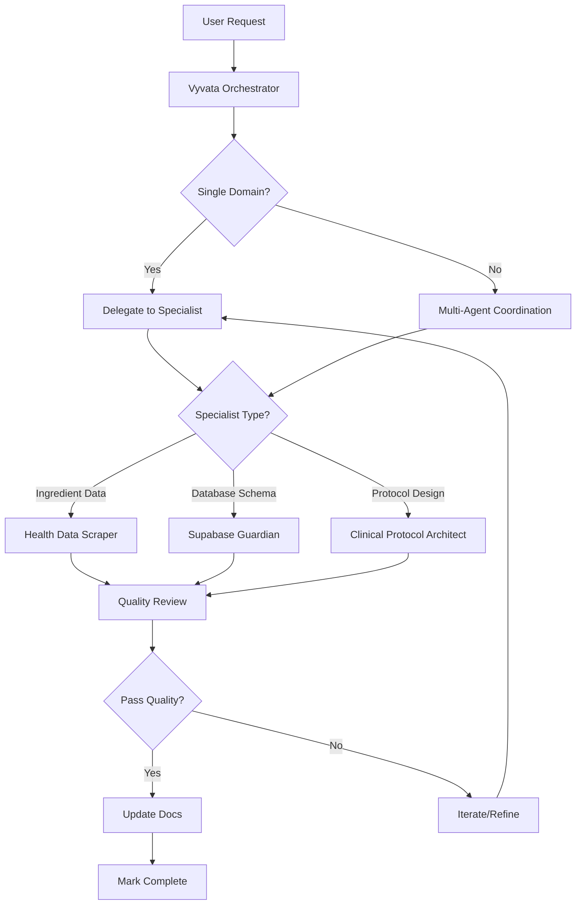

# Agent Creation Summary

## What Was Created

Four specialized AI agents have been built to ensure Vyvata exceeds production standards:

### 1. **Vyvata Project Orchestrator** 
[.agent/vyvata-orchestrator.agent.md](.agent/vyvata-orchestrator.agent.md)

**Role:** Main coordination agent — full-stack development, documentation, quality assurance, and roadmap execution.

**Key Responsibilities:**
- Execute multi-phase roadmap items with quality verification
- Keep README, ROADMAP, and technical docs current
- Review security, Next.js 16+ compatibility, and best practices
- Coordinate specialized agents and verify completion quality
- Make architectural decisions and improvement recommendations

**When to Use:**
- "Execute Phase 1 from the roadmap"
- "Review the practitioner auth flow for security vulnerabilities"
- "Update documentation to reflect current state"

---

### 2. **Health Data Scraper**
[.agent/health-data-scraper.agent.md](.agent/health-data-scraper.agent.md)

**Role:** Legally source and structure supplement/health ingredient data from authoritative sources.

**Key Responsibilities:**
- Expand ingredient DB from 51 → 150+ entries (Phase 2 goal)
- Research supplements using NIH, PubMed, Examine.com (legal sources only)
- Structure data with evidence tiers, dosing, interactions, synergies
- Maintain quality: ≥2 authoritative citations per ingredient
- Update ingredient counts in ROADMAP after expansions

**When to Use:**
- "Add 10 high-priority nootropics to the database with evidence"
- "Research vitamin D3 forms and interactions"
- "Expand adaptogens from 8 to 20 entries"

---

### 3. **Supabase Guardian**
[.agent/supabase-guardian.agent.md](.agent/supabase-guardian.agent.md)

**Role:** Database schema management, migrations, RLS policies, and Supabase operations.

**Key Responsibilities:**
- Validate schema matches application expectations (prevent drift)
- Create idempotent, versioned SQL migrations
- Audit and enforce Row-Level Security (RLS) policies
- Ensure RPC functions exist (e.g., `increment_patient_count`)
- Optimize queries and add indexes for performance

**When to Use:**
- "Validate all tables referenced in code exist in Supabase"
- "Create migration for protocols table with RLS policies"
- "Audit RPC functions for correct signatures"

---

### 4. **Clinical Protocol Architect**
[.agent/clinical-protocol-architect.agent.md](.agent/clinical-protocol-architect.agent.md)

**Role:** Evidence-based protocol design, clinical reasoning, patient education content.

**Key Responsibilities:**
- Design protocol templates (cognitive, sleep, athletic, longevity, immune)
- Write evidence summaries for practitioner dashboard (v2 feature)
- Validate rules engine for interactions, dosing, synergies
- Create patient-friendly educational content
- Build outcome tracking framework (Phase 4 prep)

**When to Use:**
- "Design a cognitive performance protocol with evidence summary"
- "Review rules engine for missing drug-nutrient warnings"
- "Write patient-friendly magnesium timing explanation"

---

## How Agents Map to Roadmap

| Roadmap Phase | Primary Agent | Supporting Agents |
|---|---|---|
| **Phase 0: Housekeeping** | Vyvata Orchestrator | Supabase Guardian (verify RPC) |
| **Phase 1: Security & Polish** | Vyvata Orchestrator | Supabase Guardian (rate limits, RLS) |
| **Phase 2: Clinical Depth** | Health Data Scraper | Clinical Protocol Architect |
| **Phase 2: Protocol Templates** | Clinical Protocol Architect | Health Data Scraper (add ingredients) |
| **Phase 2: Evidence Summaries** | Clinical Protocol Architect | — |
| **Phase 3: PDF Export** | Vyvata Orchestrator | — |
| **Phase 3: Stripe Billing** | Vyvata Orchestrator | Supabase Guardian (billing tables) |
| **Phase 4: Outcomes Tracking** | Clinical Protocol Architect | Supabase Guardian (outcomes table) |
| **Phase 4: Wearables Ingest** | Vyvata Orchestrator | Clinical Protocol Architect |

---

## Example Workflows

### Workflow 1: Execute Phase 2 (Clinical Depth)
```
User: "Execute Phase 2 from the roadmap"

→ Vyvata Orchestrator:
  - Reviews Phase 2 tasks in ROADMAP.md
  - Delegates to Health Data Scraper: "Expand ingredient DB 51→100"
  - Delegates to Clinical Protocol Architect: "Create 5 protocol templates"
  - Coordinates: "Build protocols table" (Supabase Guardian)
  - Verifies: Evidence summaries written, DB count updated
  - Marks: Phase 2 tasks complete in ROADMAP
```

### Workflow 2: Add Supplement Category
```
User: "Add 15 nootropics to the database"

→ Health Data Scraper:
  - Searches NIH ODS, PubMed, Examine.com for top nootropics
  - Structures each with: aliases, dosing, interactions, evidence tier
  - Cites ≥2 sources per ingredient (PubMed IDs)
  - Adds to ingredients-db.ts
  - Updates ROADMAP count: 51→66
  - Notifies Orchestrator for quality review
```

### Workflow 3: Set Up New Database Table
```
User: "Create the protocols table in Supabase"

→ Supabase Guardian:
  - Reviews application code to understand schema needs
  - Creates idempotent migration with: table, indexes, RLS policies
  - Tests RLS policies with sample practitioner UUIDs
  - Verifies foreign keys and constraints
  - Documents migration in /supabase/migrations/
  - Updates ROADMAP.md to mark task complete
```

---

## Agent Coordination Pattern



---

## Testing the Agents

Try these prompts to test each agent:

### Vyvata Orchestrator
- "Execute Phase 0 housekeeping tasks from the roadmap"
- "Review the app for Next.js 16 compatibility issues"
- "Update the README with current feature status"

### Health Data Scraper
- "Add L-theanine, bacopa, and lion's mane to the ingredient database"
- "Research magnesium forms (glycinate, citrate, threonate) with dosing"
- "Find top 10 longevity compounds and prepare for DB addition"

### Supabase Guardian
- "Verify that increment_patient_count RPC exists and matches usage"
- "Create a migration for the referrals table per README spec"
- "Audit all RLS policies for security vulnerabilities"

### Clinical Protocol Architect
- "Design a deep sleep recovery protocol template with evidence"
- "Review the rules engine for vitamin K + warfarin interaction"
- "Write a patient-friendly explanation of when to take vitamin D"

---

## Agent Best Practices

### Do's ✅
- Use agents for their specialized domains
- Let Orchestrator coordinate multi-domain tasks
- Verify agent work quality before marking complete
- Update ROADMAP and docs after major completions
- Cite sources (PubMed, NIH) for clinical claims

### Don'ts ❌
- Don't bypass security reviews for auth changes
- Don't add ingredients without ≥2 authoritative citations
- Don't create database migrations without RLS policies
- Don't make health claims that violate FDA regulations
- Don't mark roadmap tasks complete without verification

---

## Next Steps

1. **Test the agents** with example prompts above
2. **Execute Phase 0** (housekeeping) to validate agent coordination
3. **Provide feedback** on agent performance and clarity
4. **Iterate** on agent definitions based on real usage
5. **Scale** by adding more specialized agents as needed

---

## Agent Evolution

These agents will improve over time:
- **Add expertise** as new technologies are integrated
- **Refine boundaries** to reduce overlap
- **Document patterns** from successful completions
- **Create new agents** for emerging domains (e.g., billing, analytics)

See [AGENTS-INDEX.md](AGENTS-INDEX.md) for the living reference.
