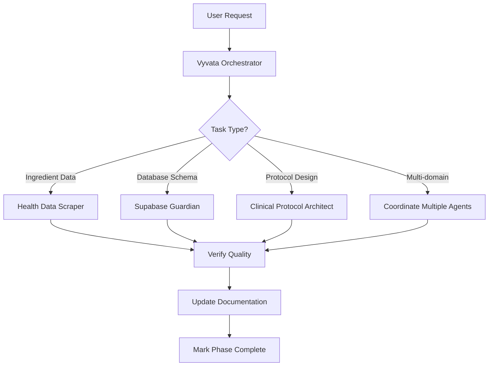

# Vyvata Agents Index

Specialized AI agents for the Vyvata health platform. Each agent has deep domain expertise and follows best practices for their specific area.

## Available Agents

### 🎯 [Vyvata Project Orchestrator](.agent/vyvata-orchestrator.agent.md)
**Main coordination agent for full-stack development, documentation, and quality assurance.**

**Use when:**
- Executing multi-phase roadmap items
- Updating README, ROADMAP, or technical docs
- Reviewing code quality, security, or best practices
- Coordinating work across multiple specialized agents
- Making architectural decisions

**Example prompts:**
- "Execute Phase 1 from the roadmap: security hardening and MVP polish"
- "Review the practitioner auth flow for security vulnerabilities"
- "Update the README to reflect current features and Next.js 16"

---

### 🔬 [Health Data Scraper](.agent/health-data-scraper.agent.md)
**Specialized in legally sourcing and structuring supplement/health ingredient data.**

**Use when:**
- Expanding the ingredient database (current: 51, target: 150+)
- Researching supplement interactions, dosing, or evidence
- Verifying data against authoritative sources (NIH, PubMed, Examine.com)
- Finding synergies or contraindications

**Example prompts:**
- "Add 10 high-priority nootropics to the ingredient database with evidence links"
- "Research vitamin B12 forms and add with interactions and dosing"
- "Expand the adaptogen category from 8 to 20 entries"

---

### 🗄️ [Supabase Guardian](.agent/supabase-guardian.agent.md)
**Database schema management, migrations, RLS policies, and Supabase operations.**

**Use when:**
- Creating or validating database migrations
- Setting up or auditing Row-Level Security (RLS) policies
- Adding tables, indexes, or RPC functions
- Debugging Supabase connection or query issues
- Optimizing database performance

**Example prompts:**
- "Validate that all tables referenced in the codebase exist in Supabase"
- "Create a migration to add the protocols table with RLS policies"
- "Audit RPC functions and ensure they match TypeScript signatures"

---

### 📋 [Clinical Protocol Architect](.agent/clinical-protocol-architect.agent.md)
**Evidence-based protocol design, clinical reasoning, and patient education content.**

**Use when:**
- Creating protocol templates (cognitive, sleep, athletic, longevity, immune)
- Writing evidence summaries for practitioner dashboard
- Validating clinical reasoning in the rules engine
- Designing patient education content
- Building outcome tracking frameworks

**Example prompts:**
- "Design a cognitive performance protocol template with evidence summary"
- "Review the rules engine for missing drug-nutrient interaction warnings"
- "Write a patient-friendly explanation of magnesium timing"

---

## Agent Coordination Workflow

For complex roadmap phases, the **Vyvata Orchestrator** coordinates specialized agents:

## How to Use Agents

### In Conversation
Simply describe your task naturally — the system will route to the appropriate agent:
- "Expand the ingredient database to 100 entries" → Health Data Scraper
- "Set up the protocols table in Supabase" → Supabase Guardian
- "Create a sleep protocol template" → Clinical Protocol Architect
- "Execute Phase 2 from the roadmap" → Vyvata Orchestrator (coordinates others)

### Explicitly Invoke an Agent
If you want a specific agent:
- "Use the Health Data Scraper to research ashwagandha"
- "Have the Supabase Guardian audit all RLS policies"

---

## Roadmap → Agent Mapping

| Roadmap Phase | Primary Agent | Supporting Agents |
|---|---|---|
| **Phase 0: Housekeeping** | Vyvata Orchestrator | Supabase Guardian (verify RPC) |
| **Phase 1: Security & Polish** | Vyvata Orchestrator | Supabase Guardian (rate limits) |
| **Phase 2: Clinical Depth** | Health Data Scraper | Clinical Protocol Architect |
| **Phase 2: Protocol Templates** | Clinical Protocol Architect | Health Data Scraper |
| **Phase 2: Evidence Summaries** | Clinical Protocol Architect | — |
| **Phase 3: PDF Export** | Vyvata Orchestrator | — |
| **Phase 3: Stripe Billing** | Vyvata Orchestrator | Supabase Guardian |
| **Phase 4: Outcomes** | Clinical Protocol Architect | Supabase Guardian |
| **Phase 4: Wearables** | Vyvata Orchestrator | Clinical Protocol Architect |

---

## Agent Best Practices

### When Creating New Agents
1. **Define clear boundaries** — avoid overlap with existing agents
2. **Specify tool preferences** — which tools to use/avoid
3. **Set success criteria** — how to know the agent succeeded
4. **Provide example prompts** — help users invoke the agent correctly
5. **Link related agents** — show coordination patterns

### When Updating Agents
1. **Keep constraints current** — update as platform evolves
2. **Refine expertise** — add new domains or remove outdated ones
3. **Document learnings** — add patterns from successful completions
4. **Version if breaking** — create v2 if responsibilities shift significantly

---

## Questions or Suggestions?

These agents evolve as Vyvata grows. If you notice:
- **Missing expertise** — suggest a new agent or expand an existing one
- **Overlapping domains** — propose clearer boundaries
- **Better coordination patterns** — share improved workflows

Update this index and the individual `.agent.md` files as needed.
